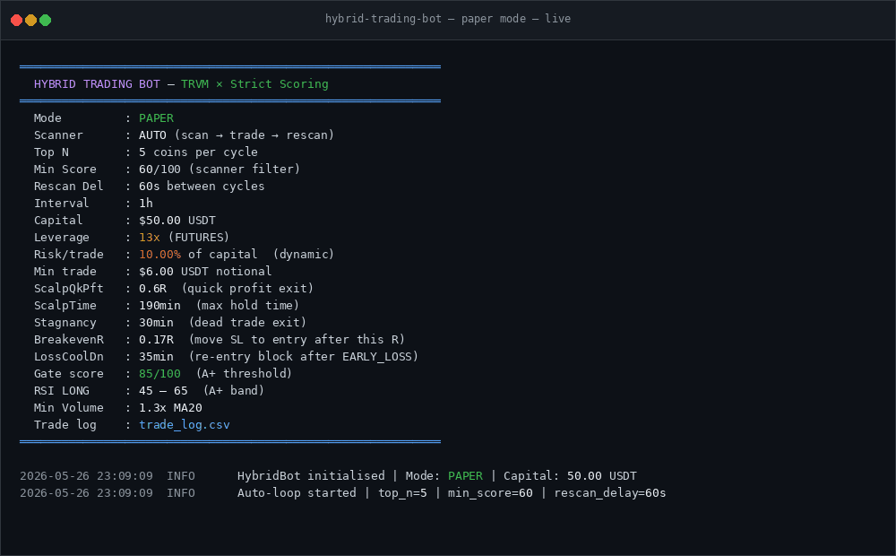
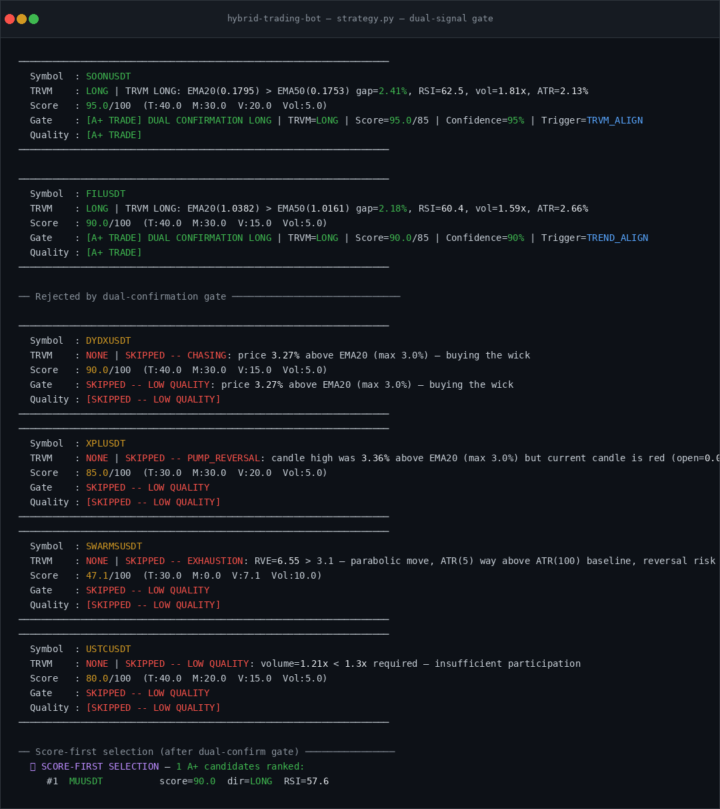
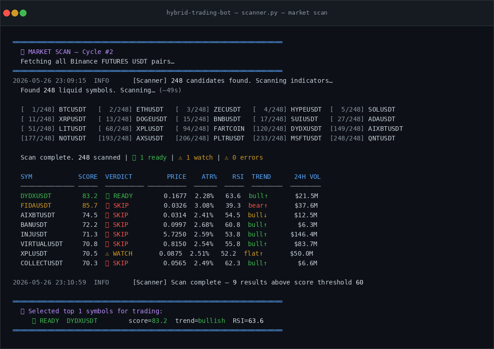
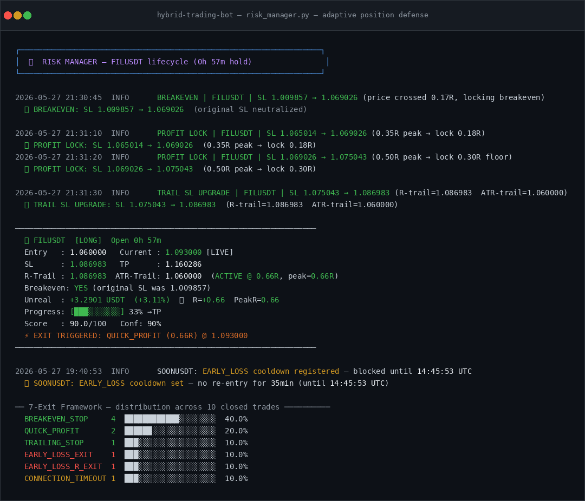
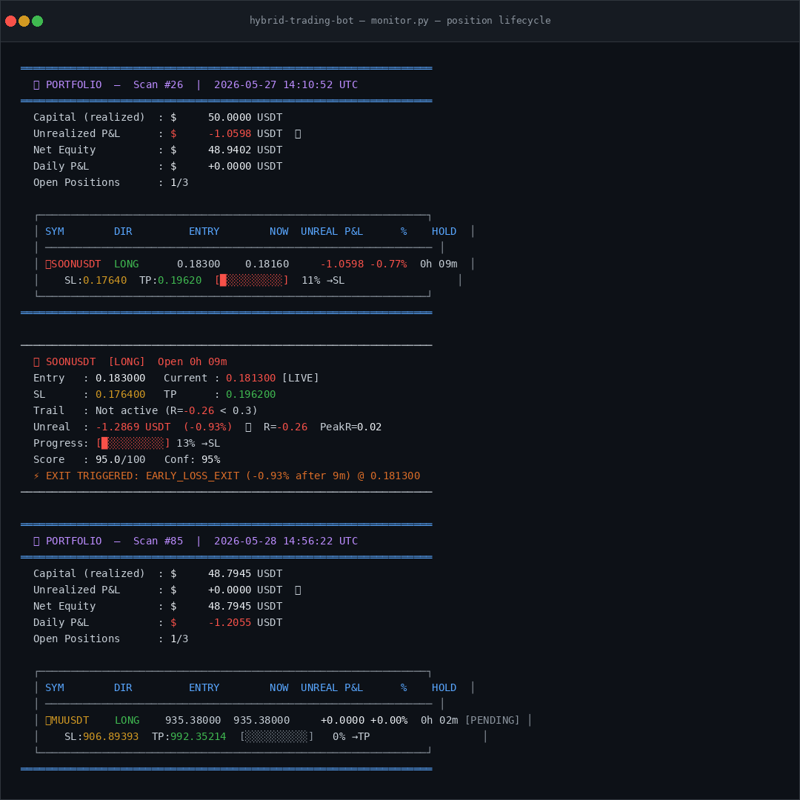
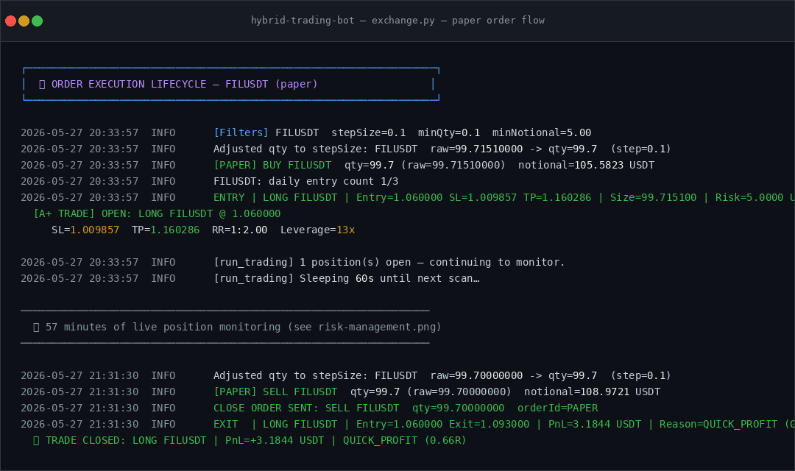
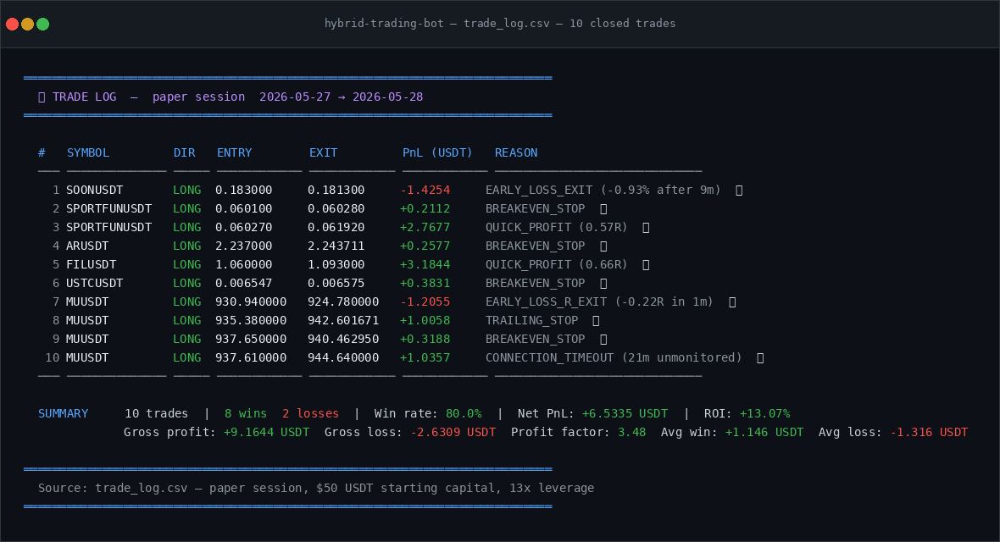
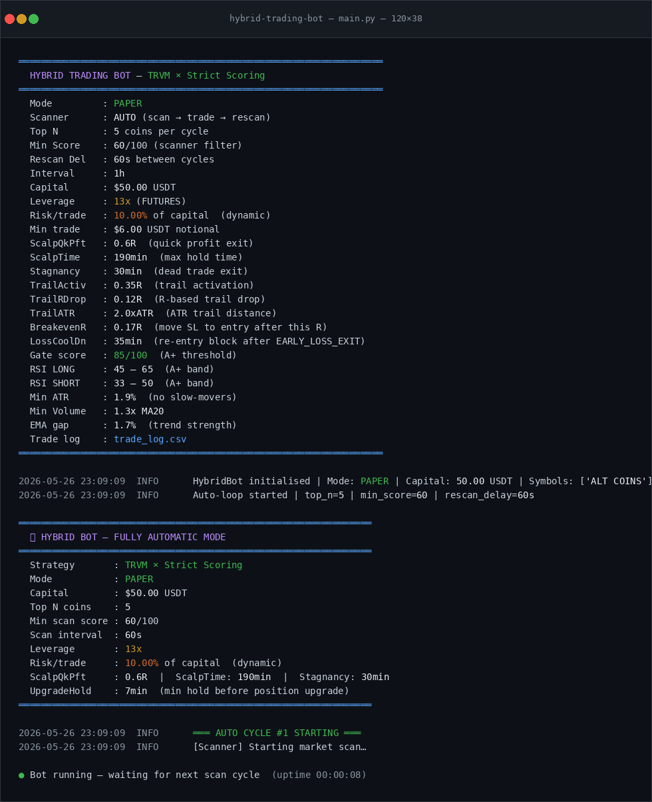

# Hybrid Trading Bot

> A dual-signal algorithmic trading system for Binance Futures — TRVM trend-following combined with multi-factor scoring, behind a strict confirmation gate, hardened through real log-driven debugging rather than a from-spec build.

[](https://www.python.org/downloads/)
[](LICENSE)
[](#quick-start)

<p align="center">
  
</p>

## Overview

This is a systematic cryptocurrency trading bot for Binance USDT-M Futures. It combines two independent signal engines — a trend-following **TRVM** engine and a multi-factor **Strict Scoring** engine — behind a dual-confirmation gate, plus a market scanner that evaluates 200-290 symbols per cycle before any candidate reaches the signal engines.

**Honest framing:** this repository is a portfolio artifact, not a marketing pitch. The bot runs in **paper mode by default** against live market data — I have not deployed it with real capital, and this README doesn't claim otherwise. What it does show is real: real config, real trade logs, and real bugs found and fixed through direct log review rather than theoretical design.

## ⚠️ Proprietary Filter Details

The full TRVM engine ships with 10+ filter layers (chasing guard, pump-reversal, post-pump recovery memory, volume-price divergence, and more), several of which were added in response to specific losing trades traced back through real paper-trading logs. Exact threshold values and the most recently added guards are available for review on request.

## Architecture

This is intentionally **one continuously-developed file**, not a pre-planned module split. It started around 4,500 lines and has grown past 6,300 as bugs were found and fixed directly against real trade logs — every fix added something rather than getting cleanly abstracted away. I think that's a more honest description of how an actively-debugged trading system actually looks than a tidy diagram would be.

```
                        ┌──────────────────────────────────────┐
                        │         Binance Futures Exchange      │
                        │   REST API + WebSocket Depth Stream   │
                        └──────────────┬───────────────────────┘
                                       │
                        ┌──────────────▼───────────────────────┐
                        │        BinanceClient                  │
                        │  ├─ HMAC-SHA256 auth                 │
                        │  ├─ LOT_SIZE / tickSize compliance   │
                        │  │  (Decimal arithmetic — see below) │
                        │  ├─ Order execution + reduceOnly     │
                        │  └─ Exchange-side SL/TP orders       │
                        └──────────────┬───────────────────────┘
                                       │
          ┌────────────────────────────┴───────────────────────────┐
          │                                                        │
┌─────────▼──────────┐                             ┌───────────────▼─────┐
│   Market Scanner    │                             │   Indicator Engine   │
│  ├─ 200-290 symbols │                             │  ├─ EMA, RSI, ATR   │
│  ├─ Pre-filtering   │                             │  ├─ MACD, ADX, RVE  │
│  └─ 0-100 scoring   │                             │  └─ Single-pass calc │
└─────────┬───────────┘                             └───────────────┬─────┘
          │                                                         │
          │         ┌───────────────────────────────────────────────┘
          │         │
┌─────────▼─────────▼──────────────────────────────────────────────────────┐
│                     TRVM × Strict Scoring Gate                           │
│    ┌─────────────────────┐    ┌─────────────────────┐                   │
│    │   TRVM Engine        │    │   Scoring Engine     │                  │
│    │   (trend-following)  │    │   (multi-factor)     │                  │
│    │   EMA/RSI/ATR/volume │    │   Trend 40%          │                  │
│    │   + chasing, pump-   │    │   Momentum 30%       │                  │
│    │   reversal, post-    │    │   Volatility 20%     │                  │
│    │   pump, divergence   │    │   Volume 10%         │                  │
│    │   guards             │    │                       │                  │
│    └──────────┬──────────┘    └──────────┬────────────┘                  │
│               └──────────────┬────────────┘                              │
│                    ┌──────────▼──────────┐                               │
│                    │  Dual-Confirm Gate  │                               │
│                    │  Both agree AND     │                               │
│                    │  Score >= 85        │                               │
│                    └──────────┬──────────┘                               │
└───────────────────────────────┼──────────────────────────────────────────┘
                                │
                        ┌───────▼────────────────────────────┐
                        │     Position & Risk Manager          │
                        │  ├─ ATR-based position sizing       │
                        │  ├─ Breakeven lock (0.17R)          │
                        │  ├─ R-based trailing stop (0.35R)   │
                        │  ├─ Priority-ordered exit framework │
                        │  └─ Daily loss limit + cooldowns    │
                        └──────────────────┬────────────────────┘
                                          │
                        ┌──────────────────▼───────────────────────┐
                        │   Liquidity Vacuum Engine (experimental)  │
                        │  ├─ WebSocket local order book           │
                        │  ├─ Wall / void detection                │
                        │  └─ Optional gate on top of TRVM+Score    │
                        └────────────────────────────────────────────┘
```

## Key Features

### Dual-Signal Confirmation

Both engines must independently agree before a trade fires:

- **TRVM Engine** — trend-following, gated on EMA alignment, RSI bands, ATR range, and volume, plus a stack of guards added directly in response to real losing trades: a "no-chasing" filter (rejects entries too far above/below EMA20), a pump-reversal guard (rejects a current candle that spiked and got rejected), and a post-pump memory guard that extends that rejection back one extra candle so a fresh 1h boundary doesn't silently reset the risk.
- **Scoring Engine** — 0-100 quality score across Trend (40%), Momentum (30%), Volatility (20%), and Volume (10%).
- **Gate threshold** — both must agree on direction, and score must clear **85/100** for an "A+" trade. The scanner's own pre-filter score (60/100) is a separate, looser bar just to decide which symbols are worth running the full pipeline on.

<p align="center">
  
  <br>
  <sub>Dual-signal gate: accepted A+ trades alongside real candidates rejected for chasing, pump-reversal, exhaustion (RVE), and insufficient volume</sub>
</p>

### Market Scanner

Every cycle pulls all Binance Futures USDT pairs, filters on liquidity and volatility, and ranks the survivors by score before any candidate reaches the signal engines.

<p align="center">
  
  <br>
  <sub>A full scan cycle: 248 symbols scanned, ranked by score, verdict, and trend direction</sub>
</p>

### Risk Management

- **ATR-based position sizing**, scaled by a configurable risk-per-trade percentage
- **Breakeven lock at 0.17R** — moves stop to entry once price has moved far enough to justify it
- **R-based trailing stop**, activating at 0.35R with a 0.12R trail distance (ATR-based trail distance available as an alternative)
- **Exchange-side STOP_MARKET / TAKE_PROFIT_MARKET orders** placed at entry, so a position stays protected even if the bot itself goes offline
- **Daily loss limit and per-symbol cooldowns** — a coin that trips an early-loss exit is blocked from re-entry for a configurable window

<p align="center">
  
  <br>
  <sub>Adaptive position defense on a real paper trade, plus the exit-reason distribution across 10 closed trades from the same session</sub>
</p>

### Priority-Ordered Exit Framework

Every open position is checked against a fixed priority order of exit conditions on each scan — profit-taking and hard risk cuts are checked before slower, patience-based exits, so a position never sits exposed waiting on a lower-priority check. Reasons seen in the real trade log below: `QUICK_PROFIT`, `BREAKEVEN_STOP`, `TRAILING_STOP`, `EARLY_LOSS_EXIT`, `EARLY_LOSS_R_EXIT`, `STAGNANCY_EXIT`, `MAX_LOSS_R`, and `CONNECTION_TIMEOUT` (a failsafe that closes a position at last-known price if the bot loses connectivity for too long — added after a real 76-minute DNS outage was traced through the logs, see below).

<p align="center">
  
  <br>
  <sub>Position lifecycle across scan cycles: a live portfolio snapshot alongside a triggered EARLY_LOSS_EXIT and a pending new entry</sub>
</p>

### Order Execution

Every order is validated against the exchange's real `LOT_SIZE` and `PRICE_FILTER` (tickSize) constraints before submission using `Decimal` arithmetic — not plain float division, which was a real bug (`0.57 / 0.01` evaluates to `56.999...` in IEEE-754 floats, silently under-sizing orders by one unit at certain boundaries).

<p align="center">
  
  <br>
  <sub>Full order lifecycle: exchange-filter compliance check, entry, 57 minutes of live monitoring, and exit with realized PnL</sub>
</p>

### Trade Log & Results

Every decision — entries, rejections, and exits — is written to `trade_log.csv` and the console log for full auditability.

<p align="center">
  
  <br>
  <sub>A real 10-trade paper session: 8 wins / 2 losses (80% win rate), profit factor 3.48, full reason-coded exit log — <code>trade_log.csv</code>, $50 starting capital, 13x leverage</sub>
</p>

### Liquidity Vacuum Engine (Experimental)

A WebSocket-based local order book maintained in memory, updated via snapshot + delta application with sequence-gap detection and automatic re-snapshotting on desync. It detects liquidity walls (unusually large resting orders) and voids (thin zones the book can't defend), and can gate entries against a thin or imbalanced book on top of the TRVM+Score signal. Also includes a separate, more experimental "vacuum scalper" mode that trades directly off void/wall signals with fixed-percent TP/SL — I documented a real limitation of that mode myself: position monitoring runs on the same 60-second loop as the swing-trade strategy, which is a timing mismatch for a signal meant to resolve in seconds.

## Debugging Highlights

A few real bugs found and fixed through direct trade-log review, not theoretical design review:

- **`peak_r` / stagnancy interaction** — `peak_r` was tracked from the live polled price only (once per 60s), so a price spike that touched a breakeven threshold and pulled back within that same minute was invisible to the bot; breakeven simply never fired. Fixing `peak_r` to track the candle's own high/low then broke the stagnancy exit, which had been (incorrectly) gated on `peak_r AND r_profit` both staying low — two individually-reasonable pieces of code, wrong together.
- **Exchange-side stop desync** — breakeven and trailing-stop upgrades were correctly tracked in memory, but the exchange-side `STOP_MARKET` order was never cancelled and replaced, meaning a disconnect right after an internal upgrade would leave the position protected at a stale, much wider stop.
- **DNS failure misdiagnosed as rate limiting** — 71 `Failed to resolve fapi.binance.com` errors in one session turned out to be `Errno -3`, an OS-level DNS resolver failure, not a Binance rate limit or a slow connection. The fix was outside the bot entirely (switching to public DNS + local caching), not a retry/backoff change.
- **Price precision (`tickSize`) rejection** — protective orders were formatted with a hardcoded `f"{price:.6f}"`, ignoring the exchange's actual `PRICE_FILTER`. For a symbol like INTCUSDT (tickSize=0.01), a 6-decimal price triggers `APIError -1111`. Fixed by reading tickSize per-symbol and formatting to the correct precision.

## Quick Start

### Prerequisites

```bash
# Python 3.11+
pip install -r requirements.txt
```

### Set API Credentials (for live market data)

```bash
export BINANCE_API_KEY="your_api_key"
export BINANCE_API_SECRET="your_api_secret"
```

### Paper Trading (Default)

```bash
# Auto-scanning mode — finds top N symbols, trades them
python system.py --mode paper --auto --top 5 --futures

# Fixed symbols
python system.py --mode paper --symbols BTCUSDT ETHUSDT --futures
```

<p align="center">
  
  <br>
  <sub>Paper-mode startup: full configuration printout followed by the auto-scan loop</sub>
</p>

### Live Trading

```bash
python system.py --mode live --auto --top 3 --futures --capital 10000
```

**I have not run this in live mode myself.** Paper mode is the default for a reason — treat live mode as unverified until you've reviewed the config against your own risk tolerance.

## Real Configuration (from an actual paper session)

These are the values from a real run, not illustrative defaults:

| Parameter | Value | Description |
|-----------|-------|-------------|
| `PAPER_MODE` | `True` | Default — no real orders placed |
| `LEVERAGE` | `13x` | Futures leverage |
| `RISK_PERCENT` | `10%` (dynamic) | Risk per trade — configurable, worth tuning down for real capital |
| `SCANNER_MIN_SCORE` | `60/100` | Pre-filter threshold to enter the signal pipeline |
| `GATE_SCORE_THRESHOLD` | `85/100` | A+ dual-confirmation threshold |
| `RSI_LONG_BAND` | `45 – 65` | RSI range for long entries |
| `RSI_SHORT_BAND` | `33 – 50` | RSI range for short entries |
| `MIN_ATR_PCT` | `1.9%` | Minimum volatility to consider a symbol |
| `MIN_VOLUME_RATIO` | `1.3x MA20` | Minimum volume vs. 20-period average |
| `EMA_GAP_MIN` | `1.7%` | Minimum EMA20/EMA50 separation for trend strength |
| `BREAKEVEN_R` | `0.17R` | Move stop to entry after this R multiple |
| `TRAIL_ACTIVATION_R` | `0.35R` | R multiple at which trailing stop activates |
| `TRAIL_R_DROP` | `0.12R` | Trail distance once active |
| `QUICK_PROFIT_R` | `0.6R` | Fast profit-take target |
| `STAGNANCY_MINUTES` | `30min` | Timeout for a position going nowhere |
| `MAX_HOLD_MINUTES` | `190min` | Hard time-based exit |
| `LOSS_COOLDOWN_MINUTES` | `35min` | Re-entry block after an early-loss exit |

## Project Structure

```
hybrid-trading-bot/
├── system.py               # Everything — scanner, signals, risk, execution, main loop
├── requirements.txt         # Dependencies
├── .gitignore
├── LICENSE
├── README.md
└── docs/
    └── screenshots/         # README screenshots and demo gif
```

## License

MIT License — see [LICENSE](LICENSE) for details.
